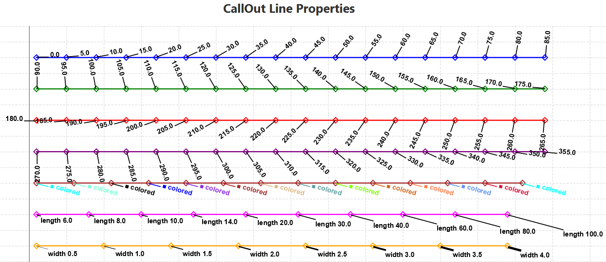

# JavaFXExtensions

## Contains a few stand alone control extensions:
  - <b>FileChoiceBox</b> - maintains a history of previously chosen files so user can choose a new file from a filepicker OR select a previously chosen file from the pull-down.
  - <b>MappedRadioButtons</b> - creates a bunch of radio buttons which display strings (the mapped-to value) but when selected return the mapped-from value.  2 features include indented sub-radio buttons and multiple columns of radio buttons.   
  - <b>Config</b> - config is a helper utility for the above.  It enables the "history state" of the FileChoiceBox control and the selected items in the MappedRadioButtons control to be saved between successive executions of your program.

## Contains a LineChart Plot Editor</b> 
The default JavaFX LineChart had some limitations in terms of available Symbols and Colors at runtime and some of those limitations are addressed by this project.  The "Editor" porition of this is to edit everything on the chart BUT the data... (i.e. colors, fonts, line sizes, etc.)

### New and Modified LineChart Features:
  - 17 symbols: 
    - diamond, circle, square, 
    - h_diamond, v_diamond, h_ellipse, v_ellipse, h_rectangle, v_rectangle,
    - up_triangle, down_triangle, right_triangle, left_triangle,
    - star5, cross, plus, checkmark 
  - There are 3 symbol styles for each symbol: 
     - filled, 
     - transparent, and 
     - white-filled
     
       

  - Chart title now includes an optional sub-title
  - Plots can have additional plot info saved in the lower left corner
  - CallOuts (Annotations)
    - A CallOut consists of a line starting at a datapoint value and extending in some direction for some length with some text at the end that can either be horizontal or in-line with the CallOut line angle.
    - A plot can have several different "series" of CallOuts each with unique settings for the CallOuts.
    - CallOuts can also be directly manipulated (moved, rotated)by the user
    
    
        
### LineChart editing Features:
After the LineChart is created and displayed a user can modify all of the following features using pop-up editors. 
Pop-up editors are invoked by right-clicking on:
  - The chart (Plot Editor, Axis Editors, CallOut Series Editors)
  - An item (data series) in the legend (Series Editor)
  - A CallOut (CallOut Editor)
  
### Plot Editor:
  - Chart title and sub title text and font sizes
  - Legend visibility or position
  - Plot Info (additional text on the plot in the lower left corner)
  - For all Series
    - Symbol info: visibility, symbol, color, size, style
    - Line info: visibility, color, width

### Series Editor (for individual series):
  - Series name
  - Symbol info: visibility, symbol, color, size, style
  - Line info: visibility, color, width
  
  
### Axis Editor:
  - Axis title, font size
  - Tic mark label font size and rotation
  
### Call Out Series Editor (for all callouts in a series):
  - Line Angle, Length, Width, and Color
  - Whether Text is rotated with the line
  - Text Size, Font Family, color, bold (or not), italicized (or not)

### Call Out Editor (for individual CallOut):
  - CallOut text
  - Line Angle, Length, Width, and Color
  - Whether Text is rotated with the line
  - Text Size, Font Family, color, bold (or not), italicized (or not)

## Additional features:
- Plots can be zoomed in/out via typical mouse movements.
- Right-click on chart Context Menu has plot save and save as options   
- A Seconds Since Midnight (SSM) axis which turns a double axis value into a HH:MM:SS.sss value (How much of HH:MM:SS.sss that is displayed depends on the zoomlevel).
- A Hover capability for data items that will display additional info when the mouse hovers over a data item.

## Requirements:
  - Java 11+ and and JavaFX 11+

## Dependencies:
  - This project depends of GitHub project https://github.com/gillius/jfxutils for several features
    - The Zooming and Panning
    - A foundation for SSM axis

## To download and use (in eclipse):
<b>Note:Current project does not use gradle or maven or any other such system.</b>
  - Clone this project (https://github.com/TomSchorsch/JavaFXExtensions) to a local git repoisitory
      - In Eclipse select Git Repository | Clone a git repository | use the above url as the location to clone
      - JavaFXExtensions imported easily into a local git repository with Next | Next | Finish
  - Import the JavaFXExtensions from the local git repository into an eclipse project
    - In Eclipse select File | import... | Git | Projects from Git | Next
    - Then select Existing local repository | Next | JavaFXExtensions | Next | Next (make sure "Import existing Git projects" is selected) | Finish
  - Create a JavaFX user Library
    - Download JavaFX 11 (download the SDK not the Jmods): https://gluonhq.com/products/javafx/ and extract the contents
    - Add  a new user library in eclipse via Windows | Preferences | Java | Build Path | User Libraries (Call it JavaFX do not make it a System library)
    - Select "Add External Jars" and browse to the JavaFX /lib directory and select the .jar files in that directory
    - Open up the JavaFXExtensions Build Path and add to the Classpath the JavaFX User Library above that you just created
  - Set up a VMargument that will include the needed JavaFX jars
    - Modify the following vm argument line below so that it points to the JavaFX lib folder (and version) you downloaded above
--module-path C:\Users\...\JAVA_INSTALL\javafx-sdk-11.0.2\lib --add-modules=javafx.controls,javafx.fxml,javafx.web,javafx.graphics,javafx.media
    - Basically replace the C:\....\lib text above with your path to the lib directory of the version of JavaFX that you downloaded.
    - In eclispe go  to: windows | preferences | java | installed JREs 
    - Highlight your installed JRE and click edit.
    - Paste the modified argument you created above into the "default VM arguments" field. 
 
  - Import the https://github.com/gillius/jfxutils project into Eclipse as a Java Project
    - <b><i>Every approach to import the jfxutils project using an Eclipse import wizard resulted in a badly messed up Maven project so I recommend the following instructions instead</b></i>
    - Browse to the above link | download it as a .zip | extract all
    - In Eclipse, create a new Java Project called jfxutils
    - In Eclipse, browse to the src directory of the fxutils project | Right-Click on source and select import... | File System | then browse to the extracted directory \jfxutils-master\jfxutils\src\main\java and select java to import
    - You should now see three packages under src - org.gillius.jfxutils, org.gillius.jfxutils.chart, and org.gillius.jfxutils.tab
    - Open up the jfxutils Build Path and add the JavaFX User Library you created to the Classpath
    - Also, open up the JavaFXExtensions Build Path and add the jfxutils project to the Classpath
    
## To run the tests associated with the project:
  - Go to the JavaFXExtensions Project to src/test/TestMain.java and execute it. 
  
